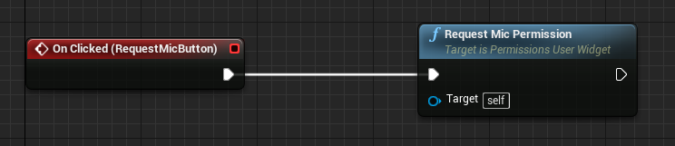
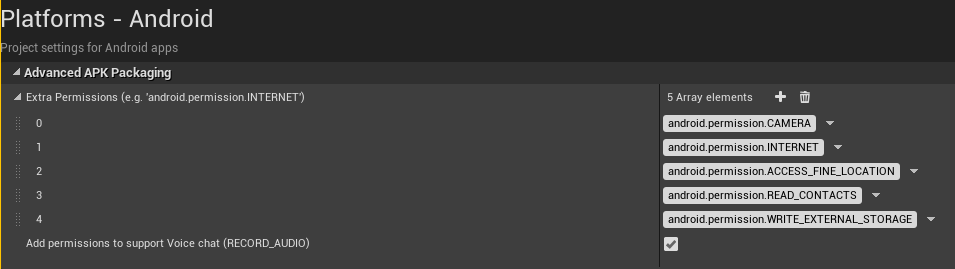

# Android Permissions & Platform Specs Sample
A sample that demonstrates how to request Android permission and fetch OS specs and states.


## Project Overview
The project has two UMG UIs.  One for handling permission and the other to display OS relates states and specs.  The UMGs derive from custom BP classes created in C++ ("PermissionsUserWidget" and "PlatformSpecsUserWidget").

## Permissions
Handling permissions is done in the "PermissionsUserWidget" class implementation.  It exposes some BP functionalities to request permissions and holds some internal BP viewable variable states.  These states are binded to the UI widgets to display whether a specific permission is enabled and to disable the request buttons if a permission is already enabled.  The buttons simply trigger the C++ functions to request permissions as shown below for the microphone permission:


The C++ logic makes use of the "UAndroidPermissionFunctionLibrary" to fetch and request permissions.  It's important that the project settings are properly setup to have the permissions that are needed for the application added to the manifest file.  This is done in the project settings as shown below:


## Platform Specs & States
The "PlatformSpecsUserWidget" class makes use of UE4's "FAndroidMisc" to get OS specific states and specifications.  The widget class just holds state variables that are then binded to the UI's widgets.  Additionally, for every tick, dynamic states are updated (such as volume and battery states).

## How to Use

### Load the project

First, ensure you have Git LFS installed by running this command:
```sh
git lfs install
```

Then, clone this repo using the "Code" button above, or this command:
```sh
git clone https://github.com/oculus-samples/Unreal-AndroidPermissions
```

### Launch the project in the Unreal Editor using one of the following options.

#### Epic Games Launcher with MetaXR plugin

The easiest way to get started is to use the prebuilt Unreal Engine from the Epic Games Launcher, with MetaXR plugin.

1. Install the [Epic Games Launcher](https://www.epicgames.com/store/en-US/download)
2. In the launcher, install UE5 (recommended).
3. Download and install the MetaXR plugin from the [Unreal Engine 5 Integration download page](https://developer.oculus.com/downloads/package/unreal-engine-5-integration).
4. Launch the Unreal Editor
5. From "Recent Projects", click "Browse" and select `AndroidPermissions.uproject`

#### Meta fork of Epic’s Unreal Engine

The Meta fork of Epic’s Unreal Engine will give you the most up to date integration of Oculus features. However, you must build the editor from its source.

Follow the instructions on [Accessing Unreal Engine source code on GitHub](https://www.unrealengine.com/en-US/ue-on-github) to obtain:
- an Epic account
- a GitHub account
- authorization to access the Unreal Engine source repository
Disregard instructions on downloading Epic’s Unreal Engine source code as you will be building the Meta fork of Epic’s Unreal Engine source.

Make sure you have Visual Studio installed properly:
- Launch the Visual Studio Installer and click Modify for the Visual Studio version you want to use.
- Under the Workloads tab, click Game development with C++ if it isn’t checked and then click Modify.

1. Download the source code from the [Meta fork of Epic’s Unreal Engine on GitHub](https://github.com/Oculus-VR/UnrealEngine).
2. Open a command prompt in the root of the Unreal, then run this command:
```sh
.\GenerateProjectFiles.bat -Game AndroidPermissions -Engine <full path to Unreal-AndroidPermissions directory>\AndroidPermissions.uproject
```
3. Open the `AndroidPermissions.sln` file that has been generated in the `Unreal-AndroidPermissions` directory.
4. Set `AndroidPermissions` as the start-up project and `Development Editor` as the configuration.
5. Hit `F5` to build and debug the project (and the engine).
    - Depending on your machine, the build may take awhile to complete.

# License
The [Meta License](./LICENSE) applies to the SDK and supporting material. The MIT License applies to only certain, clearly marked documents. If an individual file does not indicate which license it is subject to, then the Meta License applies.
